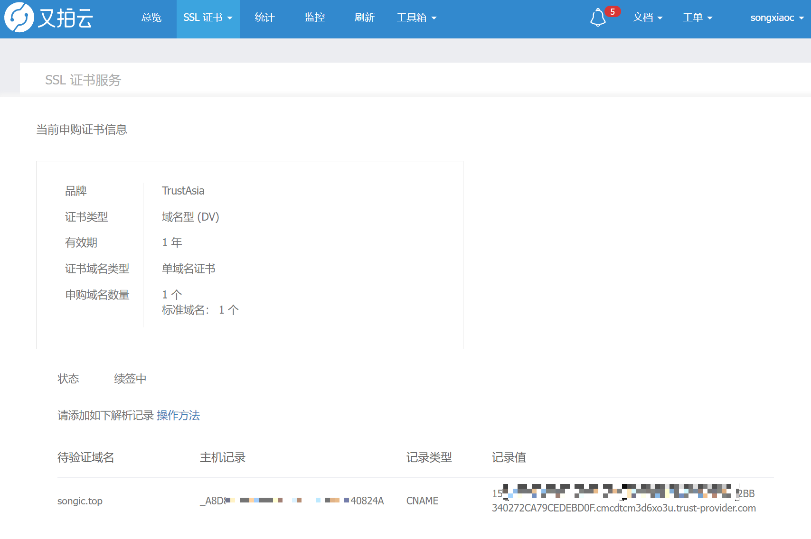

# hexo 三件套
```shell
hexo c
hexo g
hexo s
```

# 部署
```shell
hexo d
```

# 又拍云配置 HTTPS

顶部菜单栏 => SSL 证书


证书申购，选择一个免费的证书进行申请。


在申请结果，会显示购买成功的证书。选择一个点击“查看”，会显示该证书的信息。同时下方会显示该证书对应的需要验证的域名。


这里需要我们在域名提供商的后台进行 CNAME 配置，添加一条主机记录。


添加完后，证书会自动进行验证。

验证成功后就可以开启HTTPS了。


这个报错没关系，就是一个插件加载失败而已，不影响使用
```shell
INFO  Validating config
ERROR Plugin load failed: hexo-magnet-fomal
TypeError: Cannot read properties of undefined (reading 'priority')

```